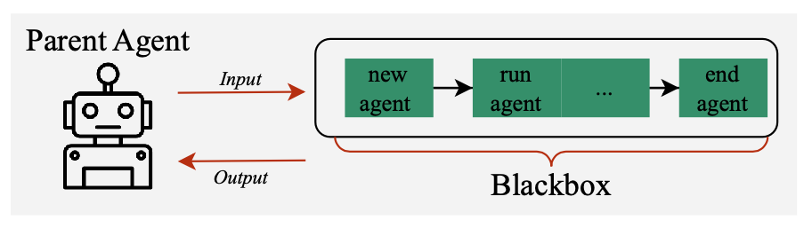
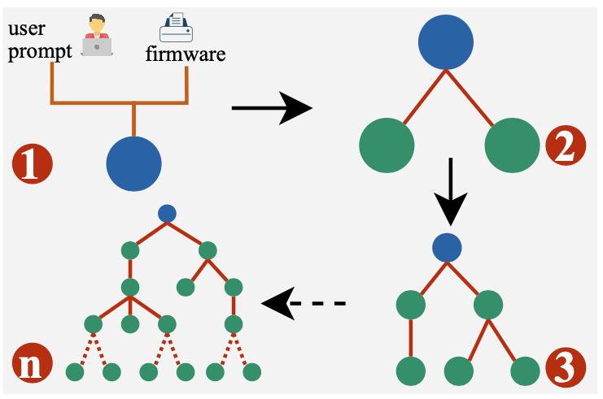
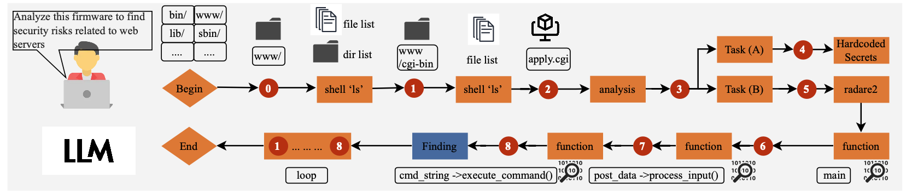
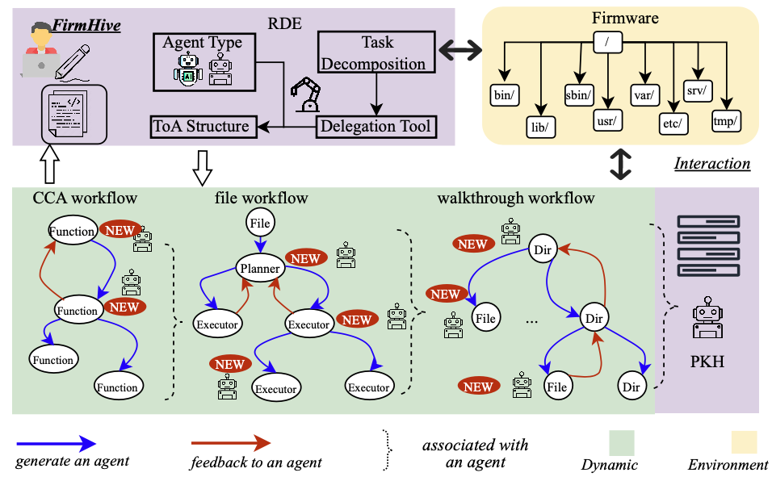
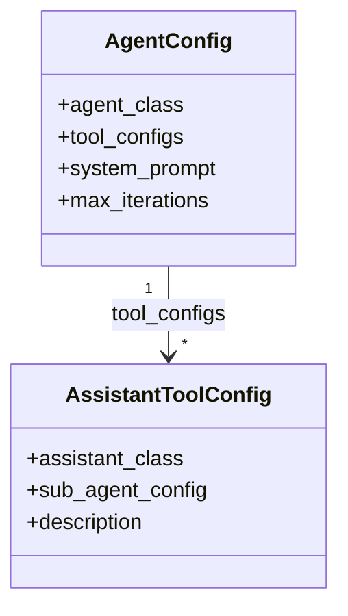
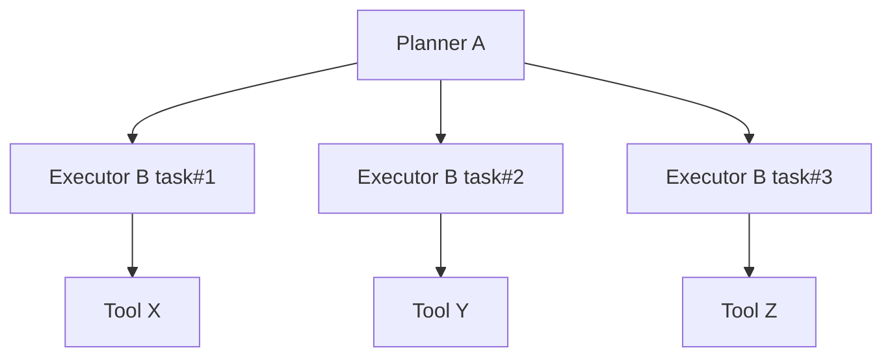
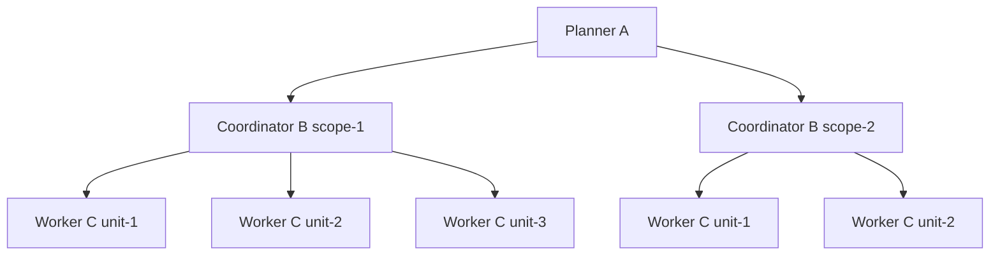
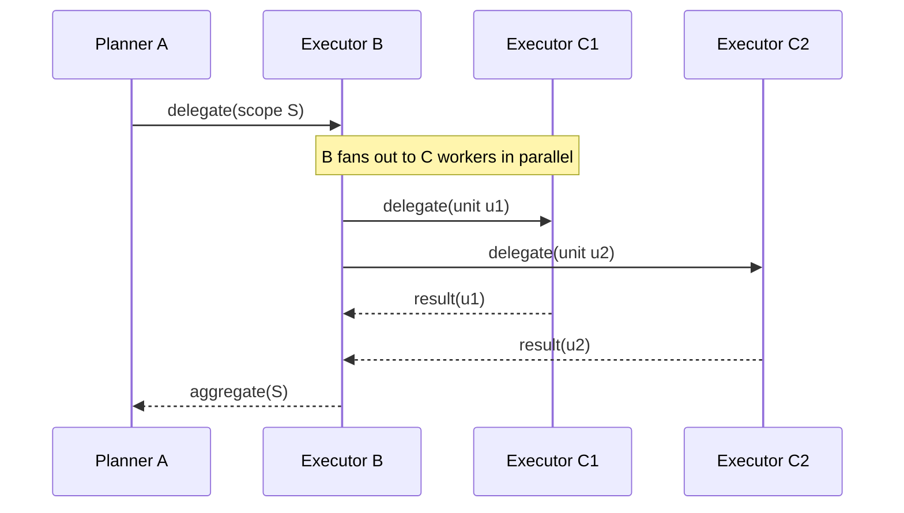

# LLMs as Firmware Experts

<div align="center">

[](https://opensource.org/licenses/Apache-2.0)
[](https://www.python.org/downloads/)
[]()

**A Runtime-Grown Tree-of-Agents Framework for Firmware Security Analysis**

</div>

---

## 📄 Paper

**LLMs as Firmware Experts: A Runtime-Grown Tree-of-Agents Framework for Firmware Security Analysis** *(Under Review)*

---

## Contents

- Key Features & Contributions
- Overview
- System Architecture
- Blueprint Examples (A/B/C)
- Analysis Tasks
- Quick Start
- Installation
- Benchmark & Evaluation
- Artifacts & Detailed Findings
- Contact
- License
- Acknowledgments

---

## ✨ Key Features & Contributions

### 🌲 **Delegation as an Ability**
Transforms task delegation from a predefined workflow into an intrinsic agent capability. Every agent can autonomously decompose complex tasks, spawn sub-agents, and manage their results for both parallel and sequential reasoning—enabling dynamic adaptation to firmware structure and analysis complexity.


<div align="center">
  
  <p><i>Figure 3: Delegation as an intrinsic agent capability</i></p>
</div>

### 🌳 **Runtime-Grown Tree of Agents (ToA)**
A novel architecture that dynamically evolves at runtime, adapting its depth and breadth to task complexity. Partitions long reasoning chains into tractable steps while supporting massive parallel exploration, addressing the fundamental challenges of deep-chain reasoning, large-scale exploration, and cross-component interaction analysis.


<div align="center">
  
  <p><i>Figure 4: Tree of Agents (ToA) - A runtime-evolving hierarchy that adapts to firmware structure</i></p>
</div>

### 🚀 **First Autonomous Firmware Analysis Framework**
FirmwareHive represents the first end-to-end autonomous LLM-based framework for firmware analysis, operating without handcrafted rules or static pipelines—fundamentally advancing the field beyond existing monolithic and orchestrator-based agent systems.

### 📊 **State-of-the-Art Performance**
- **16× more reasoning steps** compared to baseline LLM-agent systems
- **2.3× more files inspected** through systematic exploration
- **5× more alerts per firmware** through deep cross-component analysis
- **1,802 vulnerabilities identified** with **71% precision**
- Evaluated on the **Karonte firmware dataset** with real-world IoT firmware images

---

## ℹ️ Overview

**FirmwareHive** is an autonomous LLM-based firmware analysis framework that enables Large Language Models to operate as firmware security analysts. It addresses three fundamental challenges in firmware analysis:

1. **Deep-Chain Reasoning**: Tracing vulnerabilities across long logical paths spanning multiple files
2. **Large-Scale Exploration**: Systematically traversing extensive filesystems with hundreds of interdependent components
3. **Cross-Component Interaction Reasoning**: Identifying vulnerabilities arising from complex interactions among components

<div align="center">
  
  <p><i>Figure 1: FirmwareHive enables LLMs to work as expert firmware analysts through autonomous reasoning</i></p>
</div>

---

## 🏗️ System Architecture

<div align="center">
  
  <p><i>Figure 2: FirmwareHive architecture - RDE dynamically coordinates agents while PKH maintains global coherence</i></p>
</div>


### System Components

FirmwareHive implements ToA through two cooperating modules:

- **Recursive Delegation Engine (RDE)**: Dynamically generates and coordinates agents based on firmware structure, decomposing monolithic reasoning chains into structured parallel workflows.

- **Proactive Knowledge Hub (PKH)**: Acts as persistent global memory, continuously aggregating and reconciling intermediate results to preserve semantic continuity and prevent redundant exploration.


## Blueprint Examples (A/B/C)

This section uses abstract nodes A, B, C to explain how to assemble blueprints with `AgentConfig` and `AssistantToolConfig` and what the runtime Tree-of-Agents (ToA) looks like when executing. The examples are generic and not tied to specific firmware.

Key API
- `agent/core/builder.py`:
  - `AgentConfig`: defines an agent (its class, tools, system prompt, iteration cap)
  - `AssistantToolConfig`: wraps a sub-agent so the parent can delegate work to it
- `agent/core/assistants.py`:
  - `BaseAssistant`: serial delegation helper
  - `ParallelBaseAssistant`: parallel delegation helper

We will reuse built-in concrete agents for illustration:
- `PlannerAgent` (acts as A: a planner/manager)
- `ExecutorAgent` (acts as B/C: workers/executors)

Blueprint Core (rendered)



### Two-Layer Dynamic ToA (A → B)
Intent: A delegates tasks to B; B is terminal (only tools, no further delegation).

Code sketch:
```python
from agent.core.builder import AgentConfig, AssistantToolConfig
from agent.core.assistants import BaseAssistant
from firmware.planner_agent import PlannerAgent      # A
from firmware.executor_agent import ExecutorAgent    # B
from firmware.executor_agent import DEFAULT_TOOL_CLASSES

# B: terminal worker (C in more complex setups). Only tools, no assistants.
B_cfg = AgentConfig(
    agent_class=ExecutorAgent,
    tool_configs=[*DEFAULT_TOOL_CLASSES],
    system_prompt="B: Execute sub-tasks with available tools",
    max_iterations=50,
)

# A: planner that can delegate to B via an Assistant tool
A_cfg = AgentConfig(
    agent_class=PlannerAgent,
    tool_configs=[
        AssistantToolConfig(assistant_class=BaseAssistant, sub_agent_config=B_cfg,
            description="Delegate a sub-task to worker B and wait for result")
    ],
    system_prompt="A: Plan tasks; delegate to B for execution",
    max_iterations=50,
)
```

Runtime ToA effect (example execution):

- A decides sub-tasks and repeatedly invokes the assistant to spin up B instances (serially). Each B runs to completion and returns results to A.

### Three-Layer Dynamic ToA (A → B → C)
Intent: A delegates to B (coordinator for a scope), and B further delegates specific units of work to C workers.

Code sketch:
```python
from agent.core.builder import AgentConfig, AssistantToolConfig
from agent.core.assistants import BaseAssistant, ParallelBaseAssistant
from firmware.planner_agent import PlannerAgent      # A
from firmware.executor_agent import ExecutorAgent    # B/C
from firmware.executor_agent import DEFAULT_TOOL_CLASSES

# C: terminal workers for fine-grained tasks
C_cfg = AgentConfig(
    agent_class=ExecutorAgent,
    tool_configs=[*DEFAULT_TOOL_CLASSES],
    system_prompt="C: Execute granular unit of work",
    max_iterations=40,
)

# B: mid-level coordinator that may spawn multiple C in parallel for speed
B_cfg = AgentConfig(
    agent_class=ExecutorAgent,
    tool_configs=[
        AssistantToolConfig(assistant_class=ParallelBaseAssistant, sub_agent_config=C_cfg,
            description="Fan-out to multiple C workers for parallel execution")
    ],
    system_prompt="B: Partition work; fan-out to C",
    max_iterations=50,
)

# A: top planner that delegates a large scope to B
A_cfg = AgentConfig(
    agent_class=PlannerAgent,
    tool_configs=[
        AssistantToolConfig(assistant_class=BaseAssistant, sub_agent_config=B_cfg,
            description="Delegate scoped task to coordinator B")
    ],
    system_prompt="A: High-level planning and orchestration",
    max_iterations=50,
)
```

Runtime ToA effect (example execution):

- A defines scopes and delegates them to B.
- Each B partitions its scope and uses ParallelBaseAssistant to spawn several C workers concurrently, then aggregates their results.

Tips
- Replace `BaseAssistant` with `ParallelBaseAssistant` at A-level to parallelize B as well (A fan-out across scopes).
- These same patterns are used in the built-in firmware blueprint (`create_firmware_analysis_blueprint`) where directory-level and file-level analyzers play the roles of B/C respectively.

Predictability While Dynamic

Even though the ToA is built at runtime, the blueprint guarantees predictable behavior:
- Contract-first: `AgentConfig` and `AssistantToolConfig` fully describe each node's capabilities, tools, and prompts; dynamic aspects are limited to the number of spawned children and their inputs.
- Typed orchestration: assistants (`BaseAssistant`, `ParallelBaseAssistant`) drive delegation with consistent call signatures and result aggregation; no ad-hoc tool wiring.
- Bounded variability: given the same blueprint and inputs, the shape of the ToA (roles and layers) is stable; only fan-out counts vary with workload partitioning.
- Observability: all tool calls, background tasks, and injected results are logged by `BaseAgent`, enabling reproducible runs and post-hoc analysis.

Rendered Runtime Exchange (A → B → C)



---


## 📊 Artifacts

The `artifacts/` directory contains **representative samples** of vulnerability reports for documentation and review purposes:

- **T1**: Hard-coded credentials detection
- **T2**: Third-party component and CVE identification
- **T3**: NVRAM/environment variable interaction tracing
- **T4**: Web attack chain analysis
- **T5**: Comprehensive taint-style vulnerability detection

> **Note**: These are curated examples (up to 20 per task) selected for presentation. Complete analysis results are stored separately.

---

## Analysis Tasks

FirmwareHive performs five specialized security analysis tasks, each targeting different vulnerability classes with progressively complex reasoning requirements:

### T1: Find Hard-Coded Credentials
**Complexity**: Large-scale exploration + Long-term reasoning

Scans the entire firmware filesystem for embedded passwords, keys, and secrets embedded in configuration files, scripts, and binaries.

**Example Findings**: Default admin passwords, embedded API keys, hard-coded encryption keys

### T2: Identify Third-Party Components and CVEs
**Complexity**: Large-scale exploration + Dependency mapping

Identifies all third-party libraries, binaries, and executables, then correlates them with known vulnerabilities in CVE databases through version fingerprinting.

**Example Findings**: Vulnerable OpenSSL versions, outdated BusyBox with known CVEs, deprecated library components

### T3: Trace NVRAM/Environment Variable Interactions
**Complexity**: Deep dataflow analysis + Cross-component reasoning

Traces how environment variables and NVRAM settings flow through the firmware, identifying unsanitized data flows leading to dangerous function calls.

**Example Findings**: Unsanitized environment variables passed to system(), NVRAM values used in command construction

### T4: Perform Web Attack Chain Analysis
**Complexity**: Multi-layer reasoning + Attack surface analysis

Analyzes the firmware's web server implementation, maps the attack surface, and traces user-controlled input through request handlers to risky operations.

**Example Findings**: Command injection in CGI scripts, buffer overflows in web handlers, path traversal in file upload

### T5: Detect and Verify Vulnerabilities
**Complexity**: Full-stack analysis + Verification

The most comprehensive task: explores the filesystem, identifies potentially vulnerable binaries, locates dangerous functions, traces complete call chains, and verifies taint-style vulnerabilities with evidence.

**Example Findings**: End-to-end taint chains from user input to system execution, buffer overflows with proof-of-concept traces

---


## 🚀 Quick Start

### Running FirmwareHive

The entry point is `main.py`. Basic arguments:
- `--search_dir`: Path to the extracted firmware directory (or parent dir to search within)
- `--mode`: `analyze`, `verify`, or `all` (analyze then verify)
- `--output`: Output directory for results (default: `output`)
- `--concurrent`, `--max_workers`: Enable concurrent verification and set worker count
- `--finding`: Verify a specific finding text (optional)

Examples:

```bash
# 1) Analysis only
python main.py \
  --search_dir /path/to/firmware_root_or_parent \
  --mode analyze \
  --output results/run1

# 2) Analysis + Verification
python main.py \
  --search_dir /path/to/firmware_root_or_parent \
  --mode all \
  --concurrent --max_workers 4 \
  --output results/run2

# 3) Verification only (on existing findings)
python main.py \
  --search_dir /path/to/firmware_root_or_parent \
  --mode verify \
  --concurrent --max_workers 4 \
  --output results/run3

# 4) Verify a specific finding description
python main.py \
  --search_dir /path/to/firmware_root_or_parent \
  --mode verify \
  --finding "Describe the finding to verify" \
  --output results/run4
```

Tip: If your firmware was extracted with tools like binwalk and contains `squashfs-root`, you can pass the parent directory; the tool will auto-detect the firmware root.

---


## 🛠️ Installation

### System Requirements

- **Operating System**: Ubuntu 20.04 or higher (recommended)
- **Python**: 3.8 or higher
- **Binary Analysis Tools**:
  - Radare2
  - Ghidra
  - r2ghidra plugin for Radare2
- **LLM API Key**: OpenAI, DeepSeek, or compatible provider

### Setup

1. **Install System Dependencies**

   ```bash
   # Update package list
   sudo apt update
   
   # Install Radare2
   sudo apt install radare2
   
   # Install Ghidra
   # Download from https://ghidra-sre.org/
   wget https://github.com/NationalSecurityAgency/ghidra/releases/download/Ghidra_10.4_build/ghidra_10.4_PUBLIC_20230928.zip
   unzip ghidra_10.4_PUBLIC_20230928.zip
   sudo mv ghidra_10.4_PUBLIC /opt/ghidra
   
   # Install r2ghidra plugin
   r2pm init
   r2pm update
   r2pm install r2ghidra
   ```

2. **Clone the repository**

   ```bash
   git clone https://github.com/XXX/FirmwareHive.git
   cd FirmwareHive
   ```

3. **Install Python dependencies**

   ```bash
   pip install -r requirements.txt
   
   # Install r2pipe for Radare2 integration
   pip install r2pipe
   ```

4. **Configure API keys**

   Edit `config.ini` and add your LLM API credentials:
   
   ```ini
   [openai]
   model = gpt-4o
   api_key = YOUR_OPENAI_API_KEY
   base_url = https://api.openai.com/v1

   [deepseek]
   model = deepseek-chat
   api_key = YOUR_DEEPSEEK_API_KEY
   base_url = https://api.deepseek.com
   ```

5. **Verify installation**

   ```bash
   # Check Radare2 installation
   r2 -v
   
   # Check r2ghidra plugin
   r2 -c "r2pm list" | grep r2ghidra
   
   # Check Python dependencies
   python -c "import r2pipe; print('r2pipe installed successfully')"
   ```

---

## 📊 Benchmark & Evaluation

### Dataset

We evaluate FirmwareHive on the widely adopted Karonte firmware dataset:

- **Real-world IoT firmware images** from multiple vendors
- Diverse architectures and compilation configurations
- Realistic and complex firmware structures for stress-testing multi-agent reasoning

### Performance Results

FirmwareHive significantly outperforms existing LLM-agent systems and state-of-the-art tools:

**Comparison with LLM-Agent Baselines:**

| Metric | FirmwareHive | Monolithic | MAS | MAS + Orchestrator |
|--------|--------------|------------|-----|-------------------|
| **Reasoning Steps** | **16×** baseline | 1× | ~3× | ~5× |
| **Files Inspected** | **2.3×** baseline | 1× | ~1.5× | ~1.8× |
| **Alerts per Firmware** | **5×** baseline | 1× | ~2× | ~3× |

**Comparison with SOTA Tools:**

| Method | Vulnerabilities | Precision | Approach |
|--------|----------------|-----------|----------|
| **FirmwareHive** | **1,802** | **71%** | Autonomous LLM-based |
| Mango | ~863 valid | ~43% | Static analysis  |
| SaTC | 247 | None | Static analysis |

### Key Advantages

- **Higher reasoning coverage**: 16× more reasoning steps enable discovery of deep, multi-file vulnerabilities
- **Better exploration**: 2.3× more files inspected through systematic ToA-guided traversal
- **Superior precision**: 71% precision approaching expert-level analytical capability
- **Autonomous operation**: No handcrafted rules or static pipelines required

---

## 📁 Artifacts & Detailed Findings

We provide **100 representative vulnerability reports** (20 per task) with complete evidence chains in the [`artifacts/`](artifacts/) directory:

- **Structured reports** organized by analysis task (T1-T5)
- **Complete evidence chains** with precise reasoning steps
- **Representative samples** selected for academic review and presentation

📂 **Browse the artifacts**: [artifacts/README.md](artifacts/README.md)

**Example findings:**
- [T1 - Hard-coded Credentials](artifacts/T1/1-hardcoded-REDACTED_PASSWORD_PLACEHOLDER-RMT_invite_reg.htm-login.md)
- [T2 - OpenSSL Component Vulnerability](artifacts/T2/437-component-OpenSSL-1.0.0-43.md)
- [T4 - Web CGI Command Injection](artifacts/T4/103-web-cgi_target-setPwd.md)
- [T5 - Command Injection with Full Chain](artifacts/T5/1-Command-Injection-fcn.00019f38.md)


---

## Contact

For questions, issues, or collaboration opportunities: *(Under Review)*

---

## 📄 License

This project is licensed under the Apache License 2.0 - see the [LICENSE](LICENSE) file for details.

---

## 🌟 Acknowledgments

We thank the open-source community and researchers advancing LLM-based program analysis and firmware security. 

---

<div align="center">
  <b>FirmHive</b> - Enabling LLMs as Firmware Security Experts
</div>
